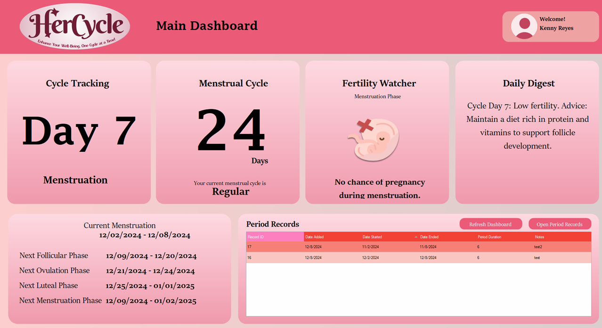

# HerCycle: Track your Flow, Fertility, and Future
A Project Presented to the Faculty of College of Computer Studies
In Partial Fulfillment of the Requirements for the Subject PF101 Object-Oriented Programming

Hercycle is a comprehensive menstrual cycle tracking application designed to help users monitor their periods, ovulation, and fertility. By logging daily biomarkers and symptoms, users can gain insights into their reproductive health, predict future cycles, and make informed decisions about their well-being. 

## Features

- Secure user registration and login system.
- Tailored pre-screening questions for personalized tracking and insights.
- Real-time cycle status, predictions, and health tips.
- Update personal information and manage account settings.
- Add, update, and delete period records with ease.

# Tech Stack

## Frontend
- **VB.NET** with **Guna UI** for enhanced UI design.

## Backend
- **VB.NET** for server-side logic.

## Database
- **[JawsDB MySQL](https://www.jawsdb.com/)** for database management.
- **[HeidiSQL](https://www.heidisql.com/)** for remote database management and access.

## Other Tools
- **[XAMPP](https://www.apachefriends.org/index.html)** for local server setup.
- **[GitHub](https://github.com/)** for version control.

## Design Prototype
- View the prototype in [Figma](https://www.figma.com/design/yD59ogcuWaVFaD1jKpTYUB/HerCycle-UI%2FUX?node-id=0-1&t=2Di5GvDJQR6tM7ah-1)
